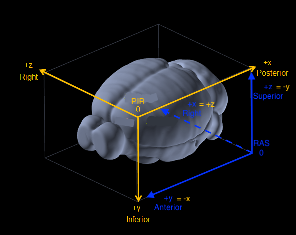

# Understanding PIR to RAS+ transformations

## Cartesian coordinate system :



### How do I identify the axis order ?
#### Posterior Inferior Right (PIR)

If we consider a brain, we can define PIR coordinate system like : 
* the +x axis is going from the ANTERIOR side of the brain to the POSTERIOR side (AP)
* the +y axis is going from the SUPERIOR side to the INFERIOR side (SI)
* the +z axis is going from the LEFT side of the brain to the RIGHT side (LR)

#### Right Anterior Superior (RAS)

If we consider a brain, we can define PIR coordinate system like : 
* the +x axis is going from the LEFT side of the brain to the RIGHT side (LR)
* the +y axis is going from the POSTERIOR side to the ANTERIOR side (PA)
* the +z axis is going from the INFERIOR side to the SUPERIOR side (IS)

### How can tranform PIR axis into RAS+ ?  

According to the previous question, we know that thoses axis can be indentify by their direction through the brain.
For instance, it's easy to imagine that going from left to right (LR) is the opposite of going from right to left (RL). So, simply, LR = - RL, but keep in mind that LR is a cartesian axis (+x in RAS+ and +z in PIR).


So, here is a simple trick to transform axis from PIR to RAS :
* `+x (RAS) = +z (PIR)` (LR = LR)
* `+y (RAS) = -x (PIR)` (AP = - PA)
* `+z (RAS) = -y (PIR)` (IS = - SI)

To make it easier, look at the image above.


### How do I get the RAS+ coordinates of a voxel when I have the PIR ones ?  

According to the previous questions, we know how to switch from a PIR system to a RAS system but it's not complete.
In fact, we want also to have the RAS+ coordinate corresponding to the PIR ones. To do that, there are two things to take into consideration : 
* the scale of each axis (shape of the bounding box)
* the position of the origin in both coordinates systems.

For example, if we want to transform our voxel coordinates from a PIR coordinate system with a shape of `(p, i, r)` to a `(r', a, s)` RAS+ coordinate system (p, i, r, r', a and s are the limit of each axis considering the respecting bounding boxes). 

Lets assume our voxel is located at `(x, y, z)` in the PIR coordinate system and `(x', y', z')` in the RAS+ system. 

So the first step is to set up our scaling factors. Let's name them `sx`, `sy`, `sz` (or s_rr', s_ap, s_si up to your preference). They represent the factors to scale the coordinate from the PIR axis corresponding to the RAS axis.
* the scaling factor from the +z R (PIR) to the +x (RAS) : `sx = r'/r`
* the scaling factor from the +x (PIR) to the +y (RAS) : `sy = a/p`
*  the scaling factor from the +y (PIR) to the +y (RAS) : `sz = s/i` 

We have now the scale of each axis, but don't forget the origin is not the same ! 

The next step is to change the distance from the PIR origin to our voxel along the PIR's axis considering the RAS+ origin and its axis.
* the distance from the RAS+ origin to the voxel along the +x (RAS) axis is equivalent to the distance from the the PIR origin to the voxel along the +z (PIR) axis: `x' = z * sx`
* the distance from the RAS+ origin to the voxel along the +y (RAS) axis is equivalent to the distance from the the limit p of +x (PIR) axis to the voxel along the -x (PIR) axis : `y' = (p-x) * sy`
* the distance from the RAS+ origin to the voxel along the +z (RAS) axis is equivalent to the distance from the the limit i of +y (PIR) axis to the voxel along the -y (PIR) axis : `z' = (i-y) * sz`


Now that we have all the elemets needed, here a simple method to transform and scale PIR coordinates to RAS+ coordinates: 

```python
def PIR_to_RAS_coords(ras_coord, pir_shape, ras_shape):
    # max len of PIR axis
    p, i, r = pir_shape[0], pir_shape[1], pir_shape[2]

    # max len of RAS+ axis
    r_, a, s = ras_shape[0], ras_shape[1], ras_shape[2]

    # scaling factors
    sx, sy, sz = r_/r, a/p, s/i

    # input PIR coordinates
    x, y, z = ras_coord[0], ras_coord[1], ras_coord[2]

    # outputs RAS+ coordinates
    x_ = z     * sx
    y_ = (p-x) * sy 
    z_ = (i-y) * sz
    
    return (x_, y_, z_)
```